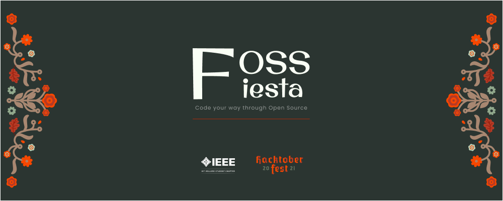

# FOSSFiesta



## About

> This project hosts the front-end of the website for [FOSSFieta](https://fossfiesta.ieeevit.org/) where you can register for the event

IEEE-VIT's event FOSSFiesta is party of free and open source softwares, consisting of 2 sessions namely Open Source Takeover and Git.Set.Go, where we would be inclined to help you solve all you doubts on open source, Hacktoberfest, GitHub, Git and have an amazing competition filled with fabulous swags at the end. 

## Tech Stack used
- React Js 
- Material UI
- Cloudfare

## Getting started
To get started:
- Clone the repo. ```git clone https://github.com/IEEE-VIT/FOSSFiesta-frontend.git```
- Checkout to a new branch. ```git checkout -b my-amazing-feature```
- Make some amazing changes.
- ```git add .```
- ```git commit -m "A short description about the feature"```
- ```git push origin my-amazing-feature```
- Open a pull request :)
- Refer to .env.sample for environment variables

## Contribute :

New contributors are always welcome to support this project. 

To start contributing, check out [CONTRIBUTING.md](https://github.com/IEEE-VIT/FOSSFiesta-frontend/blob/master/CONTRIBUTING.md). 

New contributors are always welcome to support this project 🤝


If you want something gentle to start with, check out issues labelled as easy or good-first-issue. 
Check out issues labelled as hacktoberfest if you are up for some grabs! :)

## License

This project is licensed under [MIT](https://github.com/IEEE-VIT/FOSSFiesta-frontend/blob/master/LICENSE.md)
